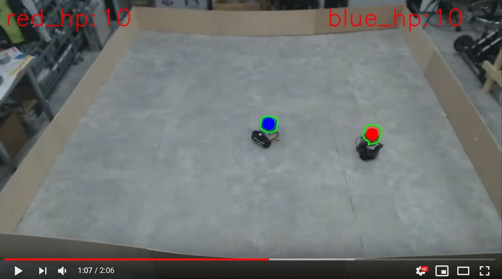
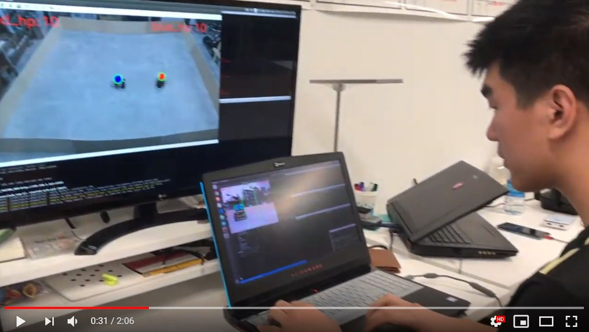
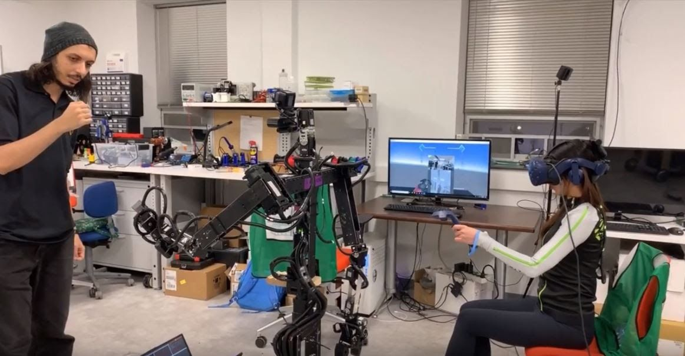

  

<h3 align="center">CS 53334/73334: Human Robot Interaction</h3>

   
  
  

---

 Monday and Wednesday from : 09:15 AM to 10:30 AM - MSB 104 Lab room

## 📝 Table of Contents
+ [1. Notes and Document: doc/](https://github.com/ksu-cs-robotics/robotics-and-embedded-system-spring-2020/tree/master/doc)
+ [2. Source Code: src/](https://github.com/ksu-cs-robotics/robotics-and-embedded-system-spring-2020/tree/master/src)

---

|||
|--|--|
|Class Instructor:|Dr. Jong-Hoon Kim|
|Office Location:|MSB 236-A|
|Office Phone:|330-672-9060|
|e-mail:|jkim72@kent.edu|
|Office Hours:|Monday and Wednesday:   10:00 AM - 11:00 AM (in person: MSB 236-B or Virtual: MS Team )   12:15 PM ~ 13:00 PM (in person: MSB 236-B or Virtual: MS Team )    Other times by appointment|
|---|---|
|Teaching Assistant:|Xiangxu Lin|
|TA-Office Hours:|By email appointment|
|TA-Email:|xlin10@kent.edu|

### Prerequisite:

This course is mainly designed for graduate students who have a research interest in human-robot interaction, with a special emphasis on robotic systems and technologies  

The course project may involve significant programming works and thus, solid mastery of computer programming skill and understanding of research methodologies  
The programming assignments will be team-based as part of the course project; thus, those with less than the required programming skills may consider this course but will need to team together with students who have more programming experience.   

Undergraduate students who want to have hands-on experience on intelligent robotics system : C or above in CS-43301 Software Development for Robotics  

### Credits:
3 (The course satisfies a requirement for the Computer Science major and minor/ CS Graduate)

### Course Outline and Objectives:
Human-Robot Interaction (HRI) is the study of interactions between humans and robots dedicated to understanding, designing, and evaluating robotic systems for use by and with humans. HRI is a multidisciplinary field that incorporates human-computer interaction, artificial intelligence, robotics, natural language understanding, design, and social sciences. Interaction between humans and robots may take several forms, but are generally categorized by how close in proximity the humans and robots are to each other such as remote, proximate, and hybrid interaction. In the class, students will learn the fundamental technologies and theories in each category, and blend this knowledge with various case studies and lab activities.

 

<a href = "​https://youtu.be/F-Cr1E8kr7c"> <h4>[Battle Bot Competition for this class] </a>

<a href = "https://www.youtube.com/watch?v=YLt52r9IgaQ"> <h4>[An Example Ongoing Project at ATR Lab] </a>

### Learning Outcomes:
Students completing this course will
- learn the theoretical & practical base for robot design and human interface design
- become familiar with Human-Robot Interaction
- deepen the knowledge of the robots and their components
- learn how to measure the performance in Human-Robot Interaction
- analyze the problems and challenges on Human-Robot Interaction 
- study the robot applications which have human in loop
- understand how to perform secure, safe, user-friendly, and smart tasks on robots
- uHand-on-Experience with Robot-Operating System (ROS), Single Board Computer(Raspberry Pi), Embedded System (Arduino), Sensors, Python, Natural Language Processing, Image Processing

### Required Text:

- No Textbook is required, but selected textbook sections and conference/ journal articles will be assigned and read as part of this course.  Reading and responses to reading questions as well as discussing and reporting on the topic/papers are definitely significant parts of the course requirement to be completed  

#### [Recommended texts for your references​]

1. “New Frontiers in Human-Robot Interaction, edited by Kerstin Dautenhahn and Joe Saunders - John Benjamin Publishing Company
2. “Context Aware Human-Robot and Human-Agent Interaction (Human–Computer Interaction Series), edited by Nadia Magnenat-Thalmann, Junsong Yuan, Daniel Thalmann, Bum-Jae You
3. "Robot Ethics, (The Ethical and Social Implications of Robotics), edited by Patrick Lin, Keith Abney, and George A. Bekey
4. “Physical Computing: Sensing and Controlling the Physical World with Computers 1st Edition”, Dan O'Sullivan and Tom Igoe, (ISBN-10: 159200346X), (ISBN-13: 978-1592003464)
5. “Arduino Cookbook- 2nd Edition”, Michael Margolis, (ISBN-10: 1449313876) , (ISBN-13: 978-1449313876)
6. “Introduction to Robotics: Mechanics and Control : Edition 4”, John J. Craig, Pearson - (ISBN-10: 0133489795), (ISBN-13: 978-0133489798)

### Grading:
Students will be evaluated based on the following course activities and graded based on the following weighting:

|Item|Percentage|(Individual/Group)|
|--|:--:|:--:|
|Attendance, Participation, and (in class) Pop Quiz|10%|individual|
|Assignments (Short project, reading and response)|20%|individual|
|Midterm Exam|10%|individual|
|Project Proposal Report and Presentation|20%|individual/group|
|Project Progress Presentation|10%| individual|
|Group Project Final Report and Presentation (demo, presentation, and report)|30%|individual/group|
|Final Exam|20%|individual|
|Total|110%|--|

|Grade|Total Percentage Earned|Grade|Total Percentage Earned|
|:--:|:--:|:--:|:--:|
|A|92.5 – 100% or above|C+|77.5 – 79.9%|
|A-|89.5 – 92.4%|C|72 – 77.4%|
|B+|87 – 89.4%|C-|68.5 – 71.9 %|
|B|82.5 – 86.9%|D|68.5 – 71.9 %|
|B-|80 – 82.4%|F|62% and below|

- **Reading Assignments:** The readings for this course will provide a broad and diverse knowledge in the field of Robotics. Some simple questions may also be posted on Blackboard LEARN for each reading, and answers to these questions should be submitted through BLACK Board by the due date.
- **Programming Assignments:** The programming assignments will provide practical experience in the field of Robotics. Most of programming assignments will be assigned during classes but some programming assignments may also be posted on Blackboard LEARN. All programming assignments should be submitted through BLACK Board by the due date.
- **Individual/Group Projects​:** The project activities are the majority of your out-of-class work for the semester. You will perform an individual & group project work in teams of 2~3, consistent throughout the semester. After forming teams early in the class, each team will improve and/or create new SW/HW design of a mobile-robot (custom turtle-bot) to address various issues and challenges. Each team will propose those challenges with the state-of-arts, will document their design and prototyping process, and will present project proposal and final presentation. In addition, each team member will have short-project progress presentation based on their assigned work in the project using a quad-chart (max 4 min).

### Tentative Outline of the Course:

### Course policy:
1. **Class participation and preparation**
    - Class participation and regular attendance are expected. If a student misses a class, the student is responsible for bringing herself/himself up-to-date on class material and assignments. If you miss more than 4 classes without a documented reason or without making prior arrangements with me, your final grade will be dropped one grade (A to B, B+ to C+ and so on).
    - All students are expected to read the assigned chapters prior to coming to class.
1. **Exams**
    - Exams will be based on the combination of: material covered in lectures, the assigned reading from the reference papers/textbooks and material covered in the notes.
    - All exams are closed books and closed notes.
1. **Homework assignments**
    - All homework assignments must be returned through the Blackboard LEARN. If the instructor requests to return an assignment directly in class, the assignment is due at the beginning of class on the specified date. Assignments turned in after the beginning of class on the due date will be counted as one day late and will receive 3 points of penalty.
    - Late penalty will be applied to all the assignment returned late. An assignment turned in n days late will get 3*n points deduction. An assignment cannot be more than 7 days late. After the 7th day the assignment will not be accepted.
    - All assignments must be individually and independently completed. Should two or more students turn in substantially the same solution or program, in the judgment of the instructor, the solution will be considered a group effort. All involved in group effort homework will receive a zero grade for that assignment. (See more details on cheating and plagiarism in the Academic Honesty Policy section below).
    - You may discuss the interpretation of an assignment with your classmates; however you may not discuss possible solutions unless you are requested by your teacher to share your solution with your colleagues.
    - No late assignment will be accepted after the assignment is graded and solution discussed.
1. **Make-up exams**
    - Make-up exams will only be given in case of serious need and only when the instructor is notified prior to the exam time. If this is not done, the grade is automatically 0 for that exam.
    - Written verification for the student’s inability to take an exam will be required.
1. **Class cancellation & Campus closings**
    - Announcements of class cancellations and/or campus closings will be made on the campus homepage. In the case of an emergency, weather-related or otherwise, please check the web page at www.kent.edu for information on the buildings and times of the closing. While information may be broadcast by radio and television, this should be confirmed by the web page, which is the official announcement of the campus and which will be the information used to determine issues related to student attendance, rescheduling of tests, and other concerns.
    - If I need to cancel class for any reason, I will try to put an announcement on the course web page as early as possible.
1. **Course Withdrawal**
    - If you are considering withdrawing from this course, please consult with a staff member in the Student Services Office, 134 Main Hall. Withdrawal from a course can affect financial aid, student status, or progress within your major. For withdrawal deadlines, please refer to: http://www.kent.edu/registrar/spring-important-dates.
1. **Academic Honesty**
    - Use of the intellectual property of others without attributing it to them is considered a serious academic offense. Cheating or plagiarism will result in a failing grade for the work or for the entire course. Repeat offenses result in dismissal from the University. University guidelines require that all infractions be reported to the Student Conduct Officer on our campus. Kent State University policy on academic honesty can be found at: http://www.kent.edu/plagiarism
1. **Students with Disabilities**
    - University policy 3-01.3 requires that students with disabilities be provided reasonable accommodations to ensure their equal access to course content. If you have a documented disability and require accommodations, please contact the instructor at the beginning of the semester to make arrangements for necessary classroom adjustments. Please note, you must first verify your eligibility for these through Student Accessibility Services (contact 330-672-3391 or visit http://www.kent.edu/sas for more information on registration procedures).
1. **Conduct**
    - Students and faculty behavior at the Kent State University is governed by the guidelines summarized in the Code of Conduct page that you can find at
http://www.kent.edu/studentconduct/code-studentconduct.
1. **Emergency**
    - In case of an emergency please contact the security on campus.
      - Pick up the receiver of any blue-light phone on campus
      - Security cell phone (330) 672-2212 or, of course, 911.
