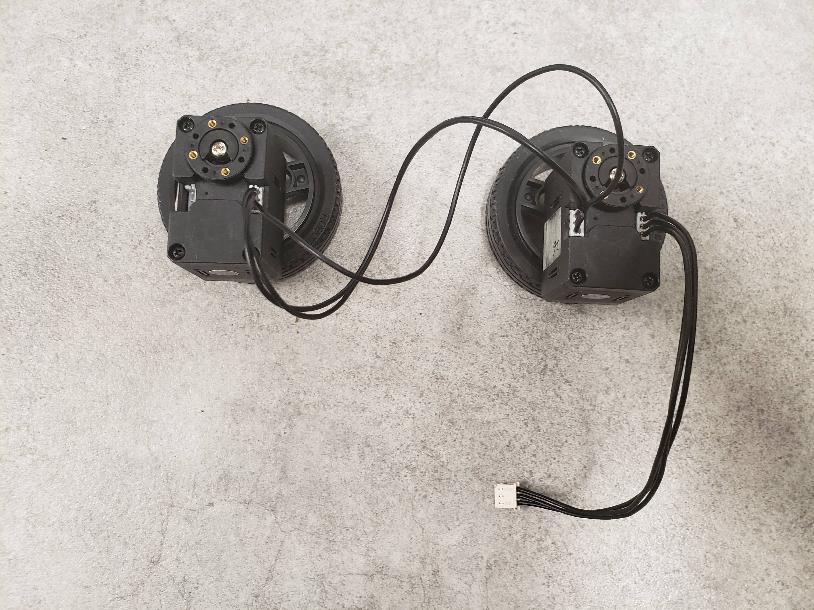
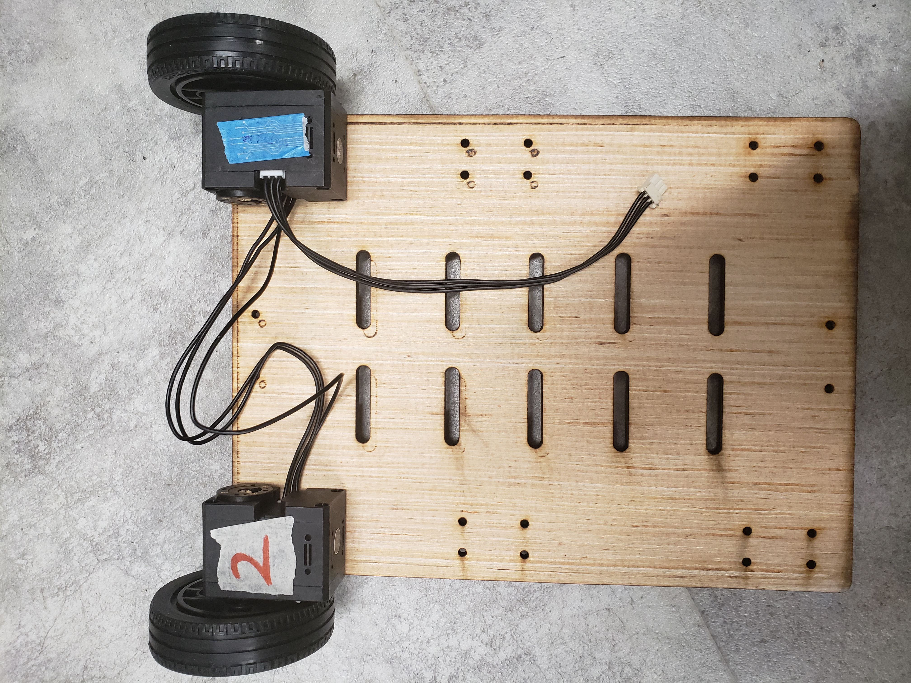
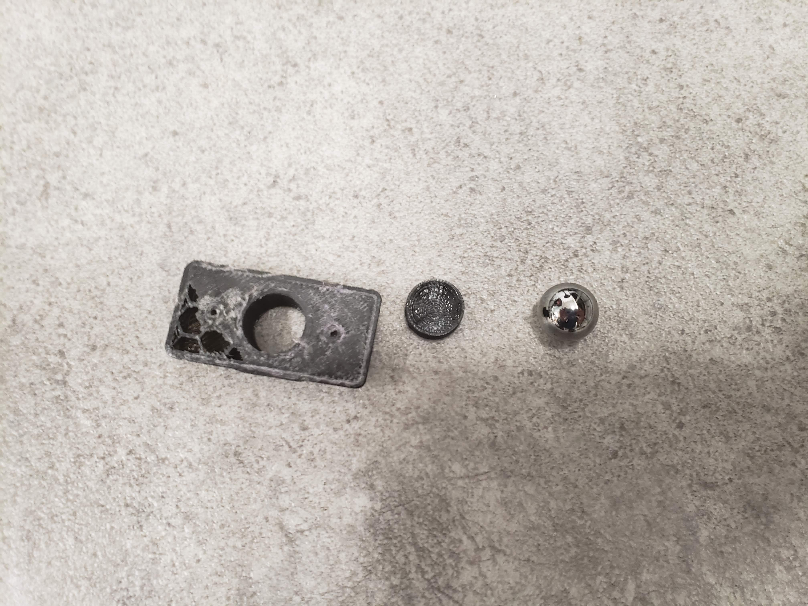
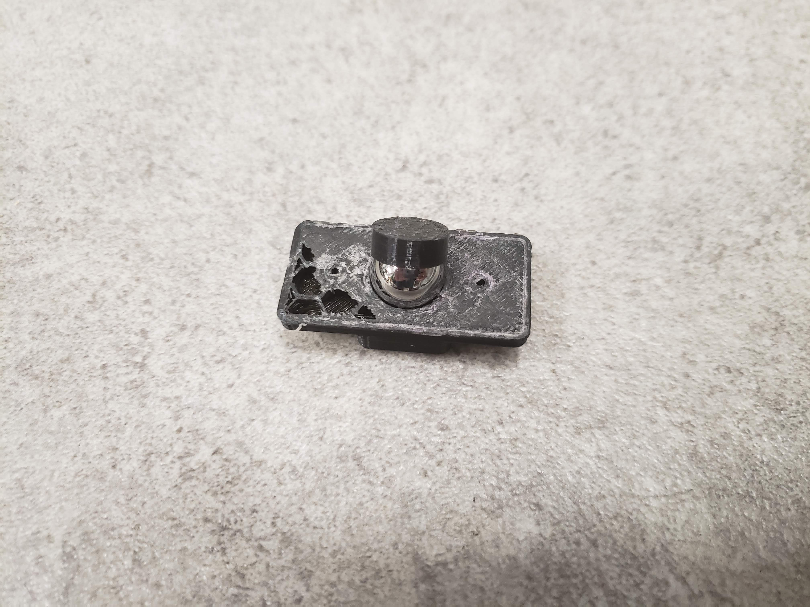
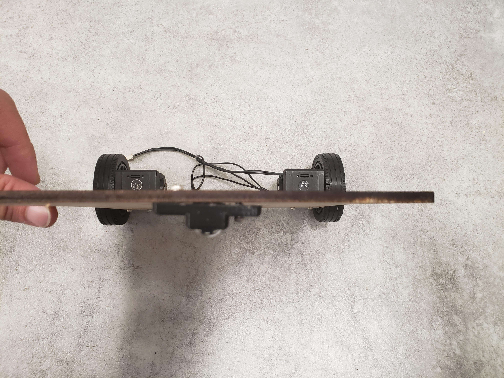
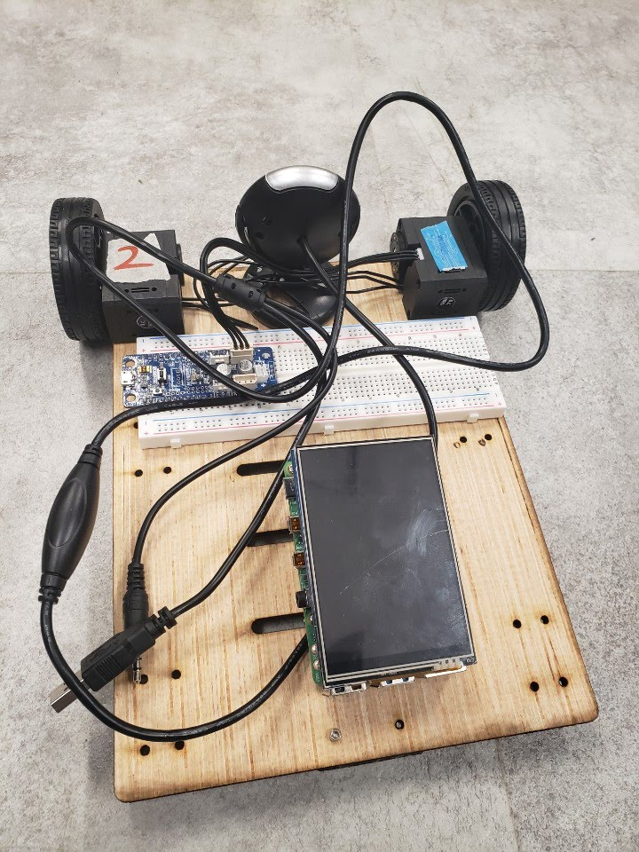

<p align="center">
  <a href="" rel="noopener">
 </a>
</p>

<h3 align="center">Software Development for Robotics</h3>

<div align="center">

  []() 
  []()
  [](/LICENSE)

</div>

---

<p align="center"> ATR Robot e-manual
</p>


## ✍️ Assemble Guide <a name = "assemble"></a>
</a>
</a>
</a>
</a>
</a>
</a>

## 📝 Software Setup
Bot base code:
```
sudo apt install ros-[your version of ROS]-turtlebot3* ros-[your version of ROS]-gmapping* ros-[your version of ROS]-depthimage-to-laserscan* ros-[your version of ROS]-ddynamic-reconfigure libuvc*

```

OpenCM:
Please download <a href="../src/ATR_Bot/Arduino/battlebot/">arduino source code</a> and upload yoru code to OpenCM

### Usage:
#### init connection:
```
#terminal 1
#this will setup the connection between your PC and arduino through ROS
roslaunch atr_nav bringup.launch
```

#### control setup:
```
#terminal 2
#this will allow you to control turtlebot3 through keyboard
rosrun turtlebot3_teleop turtlebot3_teleop_key cmd_vel:=atr/cmd_vel
```

#### camera setup:
```
#terminal 3
#this will launch camera view through ROS
roslaunch uvc_camera camera_node.launch
```

#### Visualization:
```
#terminal 4
#this will launch rviz for visualize
rosrun rviz rviz
```

<!-- 
##### Astra:
give permission to camera USB:
```
cd src/ros_astra_camera
./scripts/create_udev_rules
```
launch camera:
```
roslaunch astra_camera astra.launch
```
#### Intel RealSense:
install SDK:
```
sudo apt-key adv --keyserver keys.gnupg.net --recv-key F6E65AC044F831AC80A06380C8B3A55A6F3EFCDE || sudo apt-key adv --keyserver hkp://keyserver.ubuntu.com:80 --recv-key 
sudo add-apt-repository "deb http://realsense-hw-public.s3.amazonaws.com/Debian/apt-repo bionic main" -u
sudo apt-get install librealsense2-dkms
sudo apt-get install librealsense2-utils
sudo apt-get install librealsense2-dev
sudo apt-get install librealsense2-dbg
``` -->