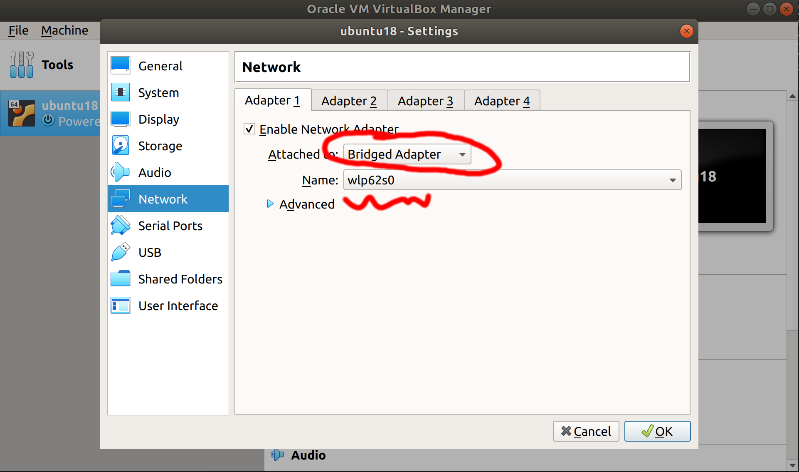

<p align="center">
  <a href="" rel="noopener">
 </a>
</p>

<h3 align="center">Software Development for Robotics</h3>

<div align="center">

  []() 
  []()
  [](/LICENSE)

</div>

---

<p align="center"> Class Notes
</p>


## ✍️ Notes <a name = "rosinstall"></a>
### 2019/10/07
**check IP address:**
- ifconfig    (linux)
- ipconfig    (windows)

**communicate your VirtualBox with ROS Master on other PC:**


**Setup your connection with ROS Master:**
- gedit ~/.bashrc **OR** nano ~/.bashrc
    - Enter these at the Bottom of your ~/.bashrc script:
        ```
            export ROS_IP=your.ip.address.here
            export ROS_MASTER_URI=http://master.ip.address.here:11311
            export ROS_HOSTNAME=your.ip.address.here
        ```

**Turtlebot3 Test and Play:**

official manual page: http://emanual.robotis.com/docs/en/platform/turtlebot3/simulation/#turtlebot3-simulation-using-fake-node
1. install: 
```sudo apt install ros-melodic-turtlebot3* ros-melodic-teleop-twist-keyboard ```

2. Run Simulation: (you can run both on your PC when you test on your own)
    - **one PC:**
    ```
    export TURTLEBOT3_MODEL=waffle_pi
    roslaunch turtlebot3_gazebo multi_turtlebot3.launch
    ```
    - **another PC:**
    ```
    rosrun teleop_twist_keyboard teleop_twist_keyboard.py cmd_vel:=tb3_2/cmd_vel
    ## check the instruction show up on terminal when you run this code and try to control the robot.
    ```
    
### 2019/10/20
**1. Remote control raspberry pi**

**Raspberry Pi:** 

enable ssh: 
```
sudo apt install ssh
sudo systemctl enable ssh
sudo systemctl start ssh
sudo rm /etc/ssh/ssh_host_*
sudo dpkg-reconfigure openssh-server
```

**Remote PC:**  
1. **Ubuntu:** open terminal and install ssh ```sudo apt install ssh```

    **Windows:** [install putty](https://www.chiark.greenend.org.uk/~sgtatham/putty/latest.html), under "MSI (‘Windows Installer’)" -> "64-bit" -> "putty-64bit-0.73-installer.msi"

2. Generate ssh config file: open terminal (Ubuntu) or CMD (Windows), enter ```ssh remote_PC_username@remote_PC_IP_address``` for example, username for our raspberry pi is atr@cs-ksu, and ip is 192.168.1.31. so you need to use ```ssh atr@192.168.1.31```

3. install **visual studio code**

4. click on **Extensions** on the left side, install "Remote - SSH **(Nightly)**" (this extension work best with "VS Code Insiders", but it is not required to have that, "VS Code" normal version would also work)

5. check out [this tutorial](https://www.hanselman.com/blog/VisualStudioCodeRemoteDevelopmentOverSSHToARaspberryPiIsButter.aspx)

    **Notes:** the IP address of your PC may change when you in a different network. even when you in the same network, IP may also change from time to time


**2. Notes on working with Raspberry pi**

1. if raspberry pi freeze or something suppose to work but doesn't work, try **unplug and plug back in**, if that doesn't solve the problem, try **google**

2. when you do ```catkin_make``` on raspberry pi, use ```catkin_make -j2``` instead, **-j2** is gonna force raspberry pi only to use two core of CPU to compile. because raspberry dont have enough computing power, it will easily freeze if you dont use **-j2**

**3. face detection:**
check out [this library](https://pypi.org/project/face_recognition/)