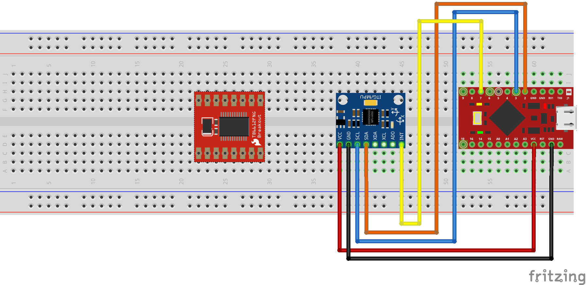
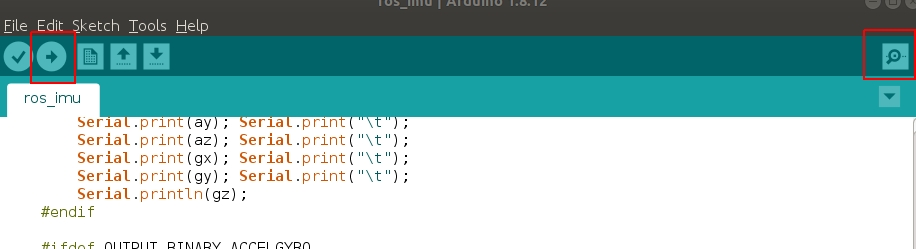

<p align="center">
  <a href="" rel="noopener">
 </a>
</p>

<h3 align="center">Software Development for Robotics</h3>

<div align="center">

  []() 
  []()
  [](/LICENSE)

</div>

---

<p align="center"> Arduino with ROS
</p>

## Basic
1. install arduino: 

    Download the latest version of Arduino IDE from the official arduino homepage, and install it. Currently, OpenCR and OpenCM9.04 will be compatible with the version 1.6.4 or later. 
    ```
    https://www.arduino.cc/en/Main/Software
    ```

    Then, extract the downloaded file to the desired folder and execute the installation file from the terminal. In this case, the example shown below makes the folder tools in the user’s top folder (~/). This folder will act as the Arduino IDE folder.
    ```
    cd ~/tools/arduino-1.8.3
    ./install.sh
    ```
    Set the file path of installed Arduino IDE as an absolute path named PATH in the bashrc file. Here recommends to use gedit editor. (Use another editor, if necessary.) Finally, source it to apply the changes.
    ```
    gedit ~/.bashrc
    export PATH=$PATH:$HOME/tools/arduino-1.8.3
    source ~/.bashrc
    ```

## 🏁 IMU : MPU6050
1. setup:
    1. Download library:

        ```
        https://github.com/jrowberg/i2cdevlib
        ```
    
    1. install library:

        copy `MPU6050` and `I2Cdev` from `i2cdevlib/Arduino` folder which you just downloaded.     -------->      to `~/Arduino/libraries` at your PC

    1. Wire:
        ```
        MPU6050     ->      ARDUINO PRO MICRO
        ----------------------------------------
        VCC         ->      VCC
        GND         ->      GND
        SCL         ->      3
        SDA         ->      2
        INT         ->      7
        ```
        

    1. Code:
        1. basic:

            open Arduino software and click on `File` -> `Examples` ->  `MPU6050` -> `MPU6050_raw`

            `upload` the code and check the `serial monitor`

            
        
        1. with ROS:

            check out the code [HERE](https://github.com/ksu-cs-robotics/software-development-for-robotics-spring-2020/tree/master/src/embedded_system/ros_imu) and `upload` it to arduino

            do the following to check result
            ```
            roscore # launch the core of ROS
            rosrun rosserial_python serial_node.py /dev/ttyACM0 # launch handler to connect to arduino for sending or receiving message
            rostopic list # check result
            ```
        